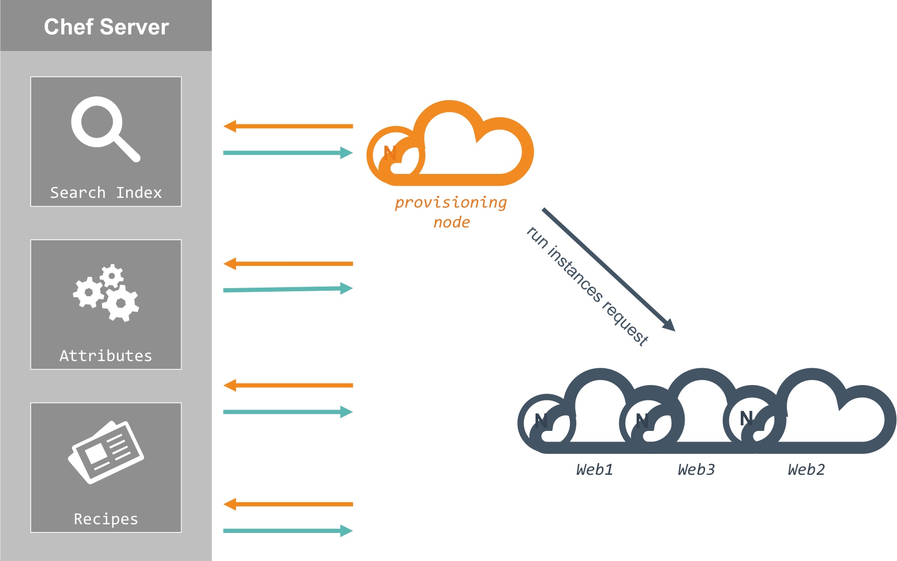

<!-- .slide: data-background="images/Chef_Vertical_Reg_Without_Inverse.png" data-background-size="500px"-->

----

<!-- .slide: data-background="#6bb2e2" style="background: rgba(255,255,255,.9); color: white" -->

# Andre Elizondo
<font color="#3f5364">Automation Engineer @ CHEF</font>

----

## Who am I?
- 1 year veteran at Chef
- Systems Administrator by trade
- Delighter

----

<!-- .slide: data-background="http://i1.kym-cdn.com/photos/images/original/000/234/739/fa5.jpg" style="background: rgba(63,83,100,.9); color: white" -->

## What do I do at Chef?

Make the first interaction with Chef as easy as possible. Work with small startups to large enterprises with their evaluation of Chef and help them on their journey.

----

<!-- .slide: data-background="images/chef-image.jpg" style="background: rgba(62,67,70,.9); color: white" -->

## What is Chef?

An automation platform that allows you to describe the state of your infrastructure as code.

```ruby
# install the package
package 'httpd'

# write the file
file '/var/www/html/index.html' do
  content "<html><body> Hello, world! </body></html>"
end

# start the service
service 'httpd' do
  action :start
end
```
<font size='4'>https://flic.kr/p/piXbnB</font>

----

<!-- .slide: data-background="https://41.media.tumblr.com/tumblr_lvk81wB5561r7yxguo1_1280.jpg" style="background: rgba(62,67,70,.9); color: white" -->

## How can Chef help me?

- Reliability of your machines
  - If your infrastructure is code you have it source controlled
- Scalably deploy changes that don't require a rebuild
  - Because why blow away your machines for a typo in a single config file?

<font size='4'>https://41.media.tumblr.com/tumblr_lvk81wB5561r7yxguo1_1280.jpg</font>

----

<!-- .slide: data-background="images/swiss-army-knife.jpg" style="background: rgba(62,67,70,.9)" -->

## Chef is versitile

- Chef can run almost anywhere
  - AWS, on-premise, containers
- Chef is multi platform
  - Best in class Windows support, AIX support, Linux, Unix, etc.

<font size='4'>https://flic.kr/p/4sYKMe</font>

----

<!-- .slide: data-background="#3f5364" -->


What's this cool thing called Chef Provisioning?

----

Describe entire clusters, in order of which they should be created or updated


<font size='4'>http://xkcd.com/1447/</font>

----

Allow for very simple creation of machines in code

```ruby
machine 'web1' do
  recipe 'apache'
end
```

----

Build out multiple machines in order

```ruby
# first make the database
machine 'database' do
  recipe 'mysql'
end

# then the web servers, one at a time
machine 'web01' do
  recipe 'apache'
end

machine 'web02' do
  recipe 'apache'
end
```

----

Sometimes we could all use some parallelism

```ruby
# chef will do this one at a time
machine 'database' do
  recipe 'mysql'
end

# this batch tells chef to do these things in parallel
machine_batch do
  machine 'web01' do
    recipe 'apache'
  end

  machine 'web02' do
    recipe 'apache'
  end
end
```

----

<!-- .slide: data-background="images/cookies.jpg" style="background: rgba(62,67,70,.9); color: white" -->

>What about if I bake my AMI's with what I need?

That's great, Chef can help with that too!

<font size='4'>https://flic.kr/p/8yv52G</font>

----

<!-- .slide: data-background="http://sweetstamper.typepad.com/.a/6a013480267ca9970c014e881075ca970d-320wi" style="background: #3e4346; color: white" data-background-size="500px" -->

AMI's can easily be a black hole when you don't code what goes into them


----

Chef Provisioning can be used to keep your AMI's up to date

```ruby
machine_image 'base-ami' do
  recipe 'ntp'
  recipe 'selinux'
  recipe 'yum'
end

machine 'web01' do
  from_image 'base-ami'
end
```

----

<!-- .slide: data-background="images/success.jpg" style="background: rgba(62,67,70,.9); color: white" -->

Now your AMI's are in code too!

----

<!-- .slide: data-background="#f18b21" -->

<font size='40'><b><i>Let's see this in action.</i></b></font>

----

<!-- .slide: data-background="#5ab7b2" style="background: rgba(255,255,255,.9); color: white"-->



----

>How can I get started?

Download the ChefDK - downloads.chef.io/chef-dk/

----

>Questions?

----

<!-- .slide: data-background="images/Chef_Vertical_Reg_Without_Inverse.png" data-background-size="500px"-->

